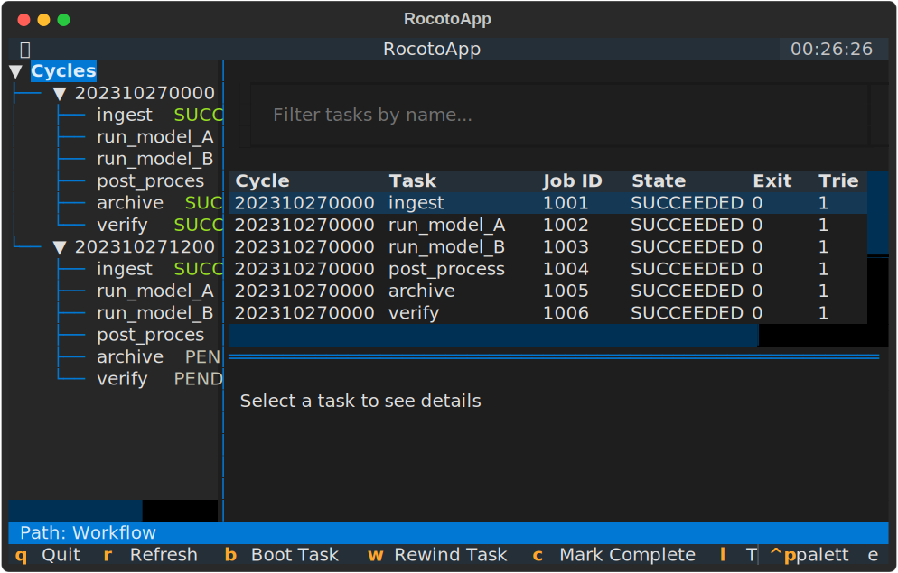

# RocotoTop

RocotoTop is a powerful Textual-based Terminal User Interface (TUI) for monitoring and interacting with Rocoto workflows in real-time.



## Features

- **Real-time Monitoring**: View the status of your Rocoto tasks and cycles in a hierarchical tree view.
- **Log Tailing**: View and follow task logs in real-time within the TUI.
- **Workflow Inspection**: Quickly see task states, exit statuses, and durations.
- **Modern TUI**: Built with [Textual](https://textual.textualize.io/) for a smooth and responsive terminal experience.
- **Easy Integration**: Simple command-line interface for specifying workflows and databases.

## Installation

### Prerequisites

- Python 3.9 or higher
- pip package manager

### From Source

1. Clone the repository:
   ```bash
   git clone https://github.com/rocototop/rocototop.git
   cd rocototop
   ```

2. Install the package:
   ```bash
   pip install .
   ```

## Usage

Start RocotoTop by providing the workflow XML and the database file:

```bash
rocototop -w my_workflow.xml -d my_database.db
```

## Key Bindings

| Key | Action |
| --- | --- |
| `q` | Quit the application |
| `r` | Refresh the workflow status |
| `l` | Toggle between Details and Log tabs |
| `f` | Toggle Log Follow mode |
| `/` | Search log (vi-style) |
| `n` | Next search match |
| `N` | Previous search match |

## License

Apache-2.0
