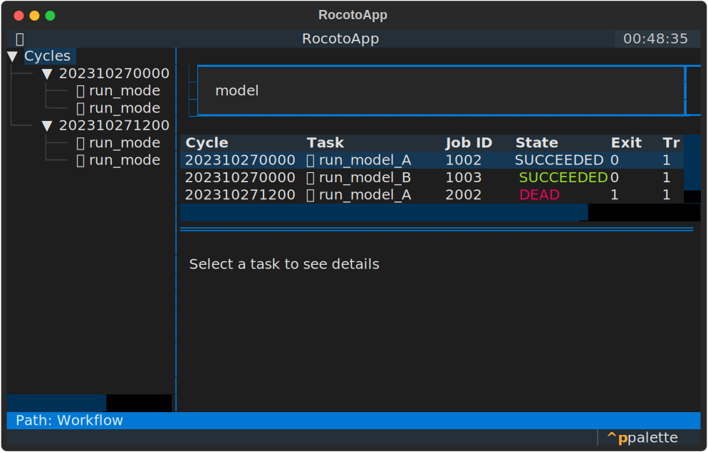
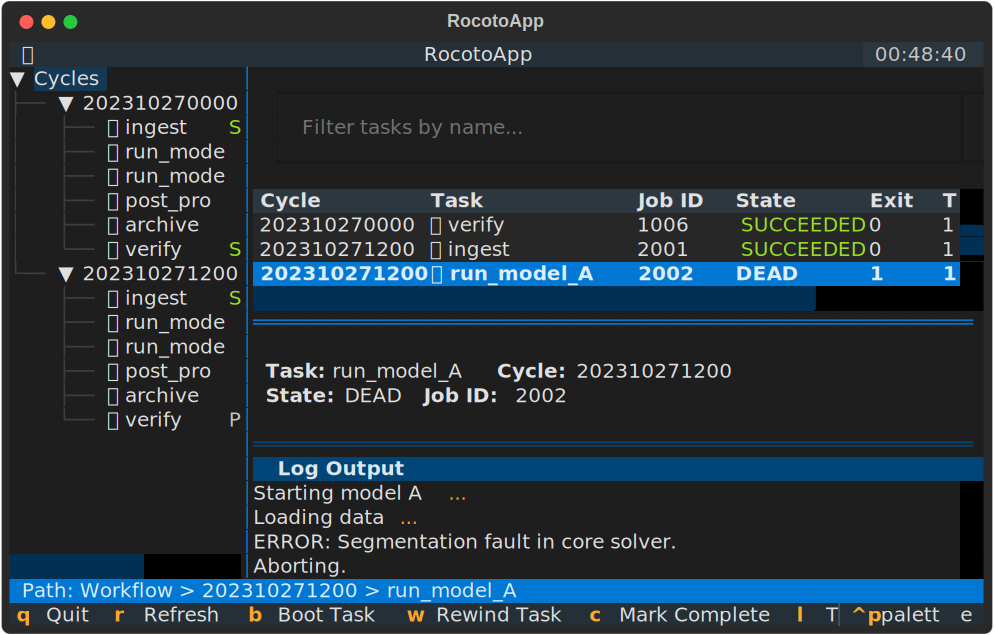

# User Guide

This guide provides a detailed walkthrough of the RocotoTop interface and its features.

## Interface Overview

RocotoTop's interface is divided into three main sections:

1.  **Sidebar (Cycle Tree)**: Displays a hierarchical view of workflow cycles and their tasks. Each cycle can be expanded to see its tasks with icons and color-coded status (e.g., ✅ for SUCCEEDED, 🏃 for RUNNING, 💀 for DEAD).
2.  **Selected Task Status**: A concise table showing the status of the currently selected task, including Job ID, State, Exit code, Tries, and Duration.
3.  **Inspection Panel (Tabbed)**: A tabbed container for detailed task information.
    - **Details Tab**: Displays comprehensive information about the task, including command, log paths, and dependencies.
    - **Log Tab**: Shows a live tail of the task's log file.
4.  **Status Bar**: Displays the "Path" to the currently selected item (e.g., Workflow > Cycle > Task).

## Key Bindings

RocotoTop's key bindings are designed to be compatible with the [NOAA rocoto_viewer.py](https://github.com/NOAA-EMC/global-workflow), making migration easier for existing users.

| Key | Action | Description |
| :--- | :--- | :--- |
| `c` | Check | Execute `rocotocheck` for the selected task. |
| `b` | Boot | Execute `rocotoboot` for the selected task. |
| `r` | Rewind | Execute `rocotorewind` for the selected task. |
| `R` | Run | Execute `rocotorun` (run the workflow engine). |
| `C` | Complete | Mark the selected task as complete via `rocotocomplete`. |
| `W` | Rewind Cycle | Execute `rocotorewind` for every task in the selected cycle. |
| `→` | Next Cycle | Navigate to the next cycle in the tree. |
| `←` | Prev Cycle | Navigate to the previous cycle in the tree. |
| `x` | Expand/Collapse | Toggle expand/collapse of the selected metatask node. |
| `l` | Reload | Reload status data from the XML and database (no rocotorun). |
| `F` | Find Running | Jump to the last cycle with a running task. |
| `t` | Toggle Log | Toggle between the Details and Log tabs. |
| `f` | Follow Log | Toggle automatic scrolling to the bottom of the log. |
| `h` | Help | Display a help overlay with all key bindings. |
| `/` | Search Log | Open the log search bar (vi-style). Type a query and press Enter. |
| `n` | Next Match | Jump to the next search match. |
| `N` | Prev Match | Jump to the previous search match. |
| `Escape` | Close Search | Dismiss the search bar and clear highlights. |
| `q` / `Q` | Quit | Exit the application. |

## Task Filtering

You can quickly find specific tasks using the filter input at the top of the main content area. Type any part of a task name to filter the visible tasks in the Cycle Tree.

## Auto-Refresh

By default, RocotoTop automatically refreshes the workflow status every 30 seconds. This ensures you have the latest information without manual intervention.

## Inspecting Task Details

When you select a task in the Cycle Tree, the Details tab in the inspection panel updates with specific information for that task instance. This includes:

- **Resolved Paths**: Log paths and commands are automatically resolved based on the cycle.
- **Resource Usage**: Account, Queue, Walltime, and Memory requirements if specified.
- **Dependencies**: A list of task dependencies and their current status.

## Log Viewing

RocotoTop allows you to view task logs directly within the TUI. When a task is selected, you can switch to the **Log** tab (or press `t`) to see the log. If the log file exists, it will be loaded and tailed in real-time.

By default, **Follow mode** is enabled, meaning the view will automatically scroll as new content is added to the log. You can toggle this behavior by pressing `f`.

## Log Search

Press `/` to open the search bar at the bottom of the log panel (vi-style). Type a regex pattern and press Enter to find matches. The current match is highlighted in yellow, and other matches get a subtle background. Use `n` to jump to the next match, `N` for the previous match, and `Escape` to close the search bar.
